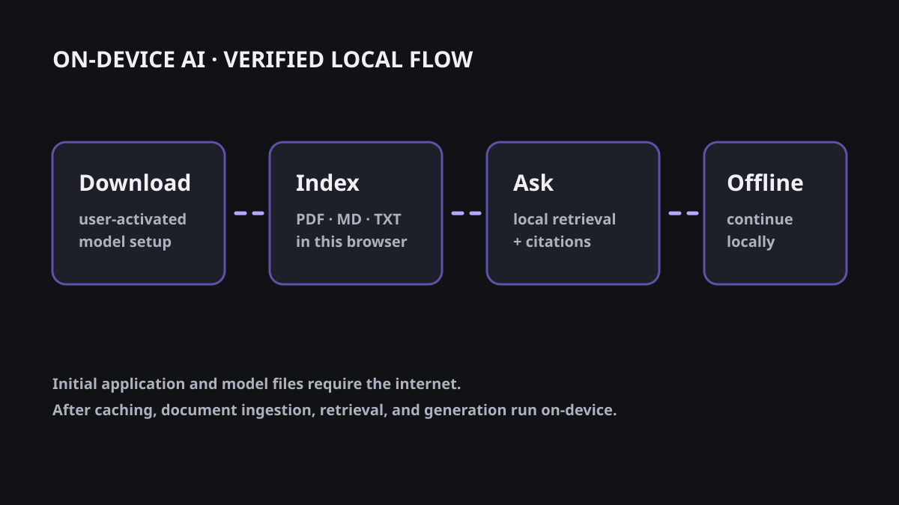

# On-device AI app starter kit



Build AI features that run on the user's hardware: browser-local GGUF inference, local retrieval,
source citations, and an offline application shell.

Live demo: [on-device-ai-app-starter-kit.web.app](https://on-device-ai-app-starter-kit.web.app)

## Privacy boundary

In LOCAL MODE, document extraction, embeddings, retrieval, and generation run in the browser. The
browser test records no post-setup document or inference request and its positive control catches
a marker-bearing request. This is an architecture plus test claim, not a claim of complete privacy.
Initial application, model, and embedding artifacts are downloaded from the internet after the
user activates setup.

## Five-minute setup

```bash
git clone https://github.com/ppradyoth/on-device-ai-app-starter-kit.git
cd on-device-ai-app-starter-kit
npm ci
npm run dev
```

Open the local URL, activate model setup, add a PDF/Markdown/text file, ask a question, and then
disconnect the network after the application and required model artifacts have been cached.

## Architecture

React and Vite serve a static shell. wllama runs the Qwen3 GGUF model in the browser with WebGPU
when available and a WebAssembly fallback. PDF.js extracts PDF text. Transformers.js runs the
embedding model in a worker. IndexedDB stores document metadata, chunks, vectors, and the verified
model blob. Retrieval is linear cosine similarity over the top four chunks. See
[docs/ARCHITECTURE.md](./docs/ARCHITECTURE.md).

## Tested browsers and devices

The recorded automated environment is an Apple M1 MacBook Air with 8 GB RAM, macOS 14.6.1, and
Chrome for Testing 153.0.8010.12 through Playwright 1.63.0. The mocked browser flow passes setup,
ingestion, citations, deletion, offline reload, and network-boundary checks. Android Chrome,
iPhone Safari, Windows, and no-WebGPU runs are not yet recorded. See
[docs/BROWSER-SUPPORT.md](./docs/BROWSER-SUPPORT.md).

## Model details

The default is `Qwen3-0.6B-Q8_0.gguf`, 639 MB decimal, Apache-2.0, with a verified SHA-256 before
loading. The model is never committed to this repository. See
[docs/MODEL-DISTRIBUTION.md](./docs/MODEL-DISTRIBUTION.md).

## Benchmarks

The ready screen reports measured time to first token, output characters, and output characters per
second for the current browser session. Optional browser memory values remain “Unavailable” when
the browser does not expose them; no memory number is invented.

Run the deterministic retrieval evaluation with:

```bash
npm run test:evaluation
```

## Security boundaries

The application limits file size and count, verifies the model hash, bounds output and retrieval,
does not use remote inference fallback, and offers complete application-owned data deletion. Text
inside documents is untrusted context; the grounded prompt is risk reduction, not prompt-injection
protection. See [docs/THREAT-MODEL.md](./docs/THREAT-MODEL.md) and [SECURITY.md](./SECURITY.md).

## iOS and Android paths

Native implementations are deliberately out of scope before `v0.1.0`. The documented paths are
integration notes only: [iOS](./docs/IOS.md) and [Android](./docs/ANDROID.md).

## Contributing

```bash
npm ci
npm run format:check
npm run lint
npm run typecheck
npm run test
npm run build
npm run test:e2e
```

Do not commit model weights, uploaded documents, indexes, caches, credentials, browser profiles,
or test artifacts containing document content. See [CONTRIBUTING.md](./CONTRIBUTING.md).

## License

The application is licensed under [MIT](./LICENSE). The selected Qwen model is distributed under
its separate [Apache-2.0 license](https://huggingface.co/Qwen/Qwen3-0.6B-GGUF/blob/main/LICENSE).
